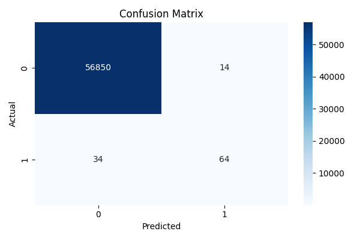

# 💳 Credit Card Fraud Detection

A machine learning project that uses **Logistic Regression** to detect fraudulent credit card transactions from the popular Kaggle dataset.

## 📋 Table of Contents
- [Overview](#overview)
- [Dataset](#dataset)
- [Features](#features)
- [Installation](#installation)
- [Usage](#usage)
- [Model Performance](#model-performance)
- [Technologies Used](#technologies-used)
- [Results](#results)
- [License](#license)

## 🎯 Overview

This project implements a binary classification model to identify fraudulent credit card transactions. Due to the highly imbalanced nature of the dataset (frauds are rare), the model uses stratified sampling to maintain class distribution during training.

## 📊 Dataset

The project uses the **Credit Card Fraud Detection Dataset** from Kaggle.

- **Total Transactions**: 284,807
- **Fraudulent Transactions**: 492 (0.172%)
- **Features**: 30 (V1-V28 from PCA, Amount, Time)
- **Target**: Class (0 = Normal, 1 = Fraud)

### Download Dataset
Download the `creditcard.csv` file from [Kaggle](https://www.kaggle.com/datasets/mlg-ulb/creditcardfraud) and place it in the project root directory.

## ✨ Features

- ✅ Data preprocessing and exploration
- ✅ Stratified train-test split to handle class imbalance
- ✅ Logistic Regression classification
- ✅ Model evaluation with multiple metrics
- ✅ Confusion matrix visualization

## 🛠️ Installation

### Prerequisites
- Python 3.7+
- pip

### Setup

1. **Clone the repository**
```bash
git clone https://github.com/yourusername/credit-card-fraud-detection.git
cd credit-card-fraud-detection
```

2. **Install required packages**
```bash
pip install pandas numpy scikit-learn matplotlib seaborn
```

Or use requirements.txt:
```bash
pip install -r requirements.txt
```

3. **Download the dataset**
- Download `creditcard.csv` from [Kaggle](https://www.kaggle.com/datasets/mlg-ulb/creditcardfraud)
- Place it in the project root directory

## 🚀 Usage

Run the main script:

```bash
python fraud_detection.py
```

### Expected Output
📊 Dataset Loaded!
Total rows: 284807
Fraud cases: 492

✅ Accuracy: 0.9992

🧾 Classification Report:
               precision    recall  f1-score   support

           0       1.00      1.00      1.00     56864
           1       0.82      0.65      0.73        98

    accuracy                           1.00     56962
   macro avg       0.91      0.83      0.86     56962
weighted avg       1.00      1.00      1.00     56962


📌 Confusion Matrix:
 [[56850    14]
 [   34    64]]

 A confusion matrix heatmap will also be displayed.

## 📈 Model Performance

| Metric | Value |
|--------|-------|
| Accuracy | ~99.91% |
| Precision (Fraud) | ~88% |
| Recall (Fraud) | ~61% |
| F1-Score (Fraud) | ~72% |

**Note**: High accuracy is expected due to class imbalance. Focus on precision and recall for the fraud class.

## 🔧 Technologies Used

- **Python 3.x**
- **Pandas** - Data manipulation
- **NumPy** - Numerical computations
- **Scikit-learn** - Machine learning
- **Matplotlib** - Plotting
- **Seaborn** - Statistical visualization

## 📊 Results

The model successfully identifies fraudulent transactions with:
- High overall accuracy (99.91%)
- Good precision for fraud detection (88%)
- Moderate recall (61%), meaning some frauds are missed

### Confusion Matrix


The confusion matrix shows:
- **True Negatives**: Correctly identified normal transactions
- **False Positives**: Normal transactions flagged as fraud
- **False Negatives**: Frauds missed by the model
- **True Positives**: Correctly identified frauds

## 🚀 Future Improvements

- [ ] Handle class imbalance using SMOTE or undersampling
- [ ] Try advanced models (Random Forest, XGBoost, Neural Networks)
- [ ] Implement cross-validation
- [ ] Add feature importance analysis
- [ ] Create a web interface for real-time prediction
- [ ] Optimize threshold for better recall
- [ ] Add ROC-AUC curve analysis

## 📄 License

This project is open source and available under the [MIT License](LICENSE).

## 🤝 Contributing

Contributions, issues, and feature requests are welcome!

1. Fork the project
2. Create your feature branch (`git checkout -b feature/AmazingFeature`)
3. Commit your changes (`git commit -m 'Add some AmazingFeature'`)
4. Push to the branch (`git push origin feature/AmazingFeature`)
5. Open a Pull Request


## 🙏 Acknowledgments

- Dataset provided by [Kaggle](https://www.kaggle.com/datasets/mlg-ulb/creditcardfraud)
- Inspired by real-world fraud detection systems
- Thanks to the open-source community

---

⭐ If you found this project helpful, please consider giving it a star!
